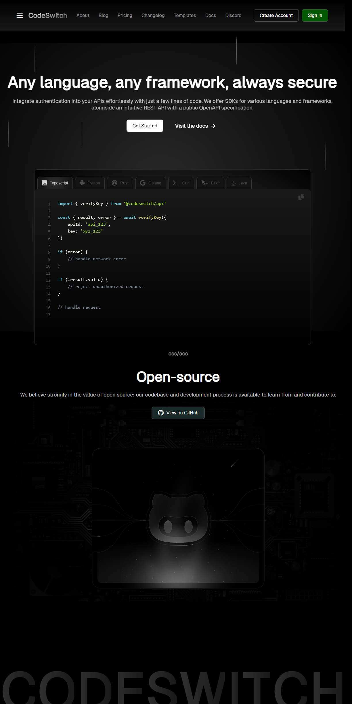

# Code Switcher

Code Switcher is a stylish frontend project created through the [Frontend Now](https://www.learnfrontendnow.com/) course containing a section that swaps between differnet code languages with example code showing off the syntax and style of that language.